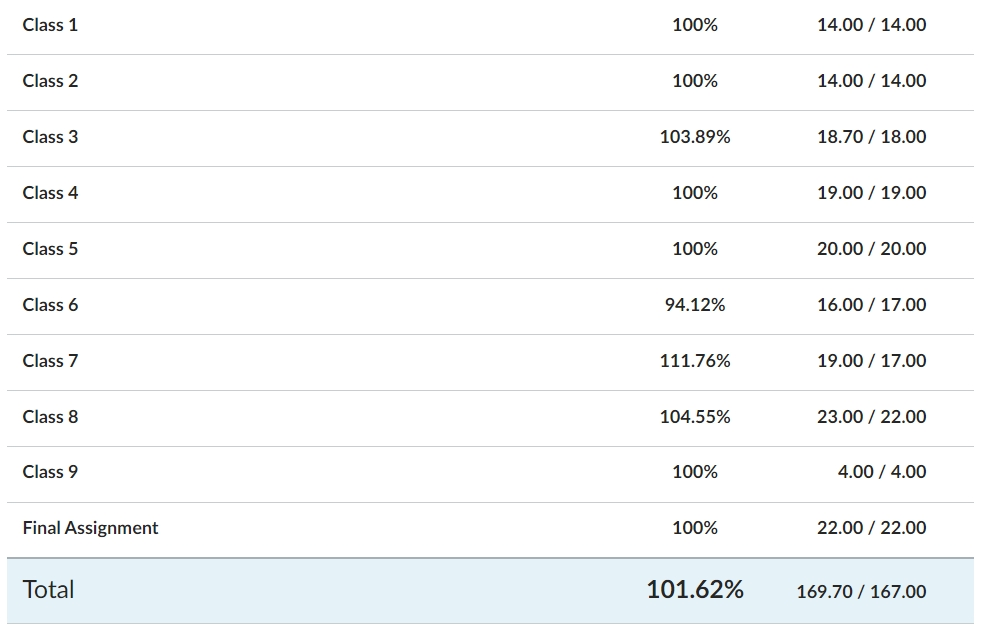

#  _"Programming for the Browser With JavaScript"_

 

[🪪 Click here to see my badge of completion 🪪](https://continuumuw.badgr.com/public/assertions/CN0baYDJT1alwUQHGHO_iQ)

   

Below are my school assignments from the 2024 Fall quarter of the University of Washington's ["Full-Stack Development With JavaScript" certificate program](https://www.pce.uw.edu/certificates/full-stack-development-with-javascript) :

* [Class 8 - Timing Functions & API interactions](/Class_8/): setTimeout(), setInterval(), requestAnimationFrame(), Promise(), fetch()

* [Class 7 - Forms](/Class_7_Contact.js): Form Validation

* [Class 6 - jQuery](/jQuery_exercises/): Two different assignments to practice using the jQuery library for DOM manipulation

* [Class 6 - Prototypes inside Classes](/Class_6_Prototypes.js): Using prototypes during Object creation

* [Class 5 - CRUD of elements, X/Y axis location, and To-do List](/Class_5/): DOM Manipulation

* [Class 4 - Blackjack Game](/Class_4_Blackjack.js): Loops and some DOM Manipulation

* [Class 4 - Loops](/Class_4_Loops.js): If and For Loops

* [Class 3 - Soccer](Class_3_soccer.js):  forEach() array method

* [Class 3 - SpaceShips, Get Phone Number, & Log Receipt](Class_3_Classes&Objects.js):  Classes, Constructor Functions, Objects, RegEx, and For loops

* [Class 3 - BattleGame](Class_3_battleGame.js):  Functions and random numbers

* [Class 2](Class_2_Exercises.js):  Objects, Arrays, RegEx, and Date constructor function

* [Class 1](Class_1_Exercises.js):  Math objects, Indexof, Substring, and getTime

 

 

## Grades

